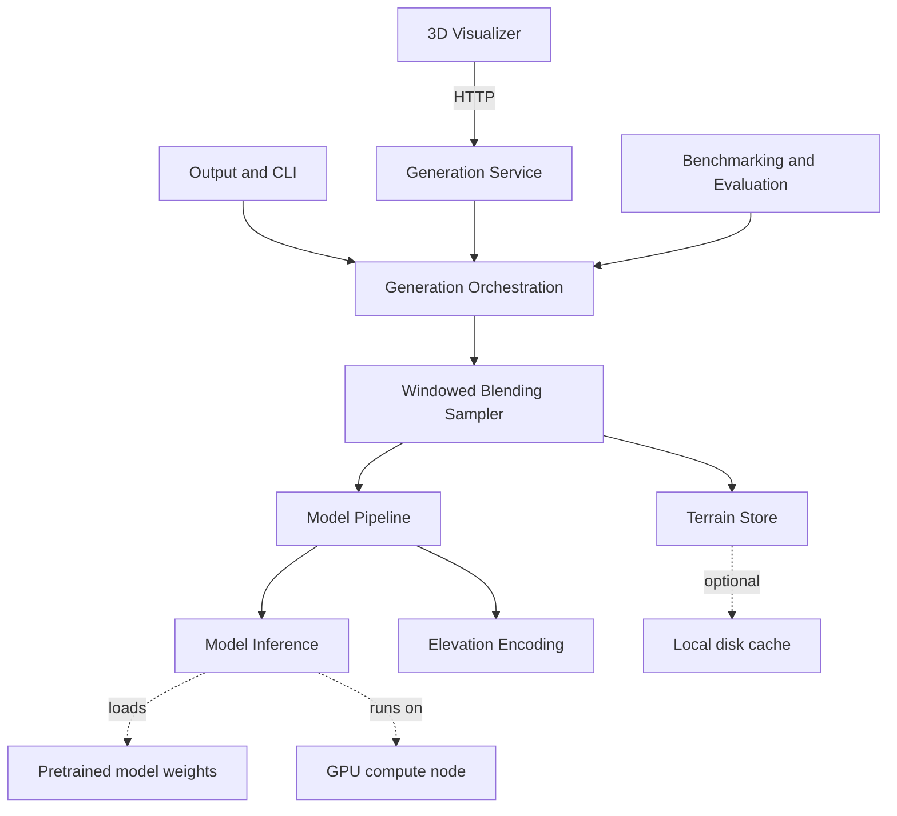

# terrain-diffusion

A reproduction of the [InfiniteDiffusion paper](https://arxiv.org/abs/2512.08309).

A game world like Minecraft lets a player walk in any direction forever, but the terrain looks blocky and artificial. An AI image generator can paint a realistic landscape, but only one fixed size image, not an endless world.

This project produces a realistic, endless landscape from a seed. A user chooses a seed, which is a number that fully determines the world, and explores the terrain in a 3D view. The land has sharp ridges, river valleys, and coastlines, and it continues in every direction without end.

Two properties define it:

- Seamless and infinite. However far a user travels, the land lines up and never repeats.
- Constant memory. Exploring a large area uses no more memory than exploring a small one, because terrain is created only where the user is looking.

The same seed always recreates the same world.

The models are already trained by the paper's authors. Training terrain models of this kind costs thousands of dollars and takes months, so this project does not train them. It uses the released weights and rebuilds the algorithm that runs on top of them. Running a model needs about 2.2 GB of GPU memory, so a free cloud GPU or a gaming laptop is enough.

The project has its own machine, an RTX 2060 with 6 GB, confirmed able to serve the backend publicly through an outbound tunnel. What that machine can and cannot do is in [docs/machine-findings.md](docs/machine-findings.md), and it constrains a few things: latency will be several times the paper's figures, and there is about 3 GB of GPU memory spare rather than the whole card.

## What we are building first

The MVP:

- As a user, I can give a seed and a region size and receive a height map image.
- As a user, I can give a seed and a region size of more than one tile and get terrain whose tiles meet with no visible seams.
- As a user, I can give the same seed twice and get exactly the same terrain both times. Exactly means bit for bit on the same machine at the same precision. Across different machines, or between full and half precision, terrain matches within a small tolerance instead.
- As a user, I can give a seed and a region and view the result as a 3D surface.

## How the system fits together

The system answers one question: what does the world look like at a given seed and coordinate. It turns the answer into images and an interactive 3D view.



Which features live where:

- Model Inference runs a single neural model on a patch and holds the GPU and weight concerns.
- The Model Pipeline composes the core model, the decoder, and the elevation transforms into one finished full resolution patch.
- Elevation Encoding holds the reversible transforms the real models require.
- The Windowed Blending Sampler holds the core generation math.
- The Terrain Store holds memory behaviour, from bounded to lazy to infinite.
- Generation Orchestration drives a region, and in the build-out coordinates the multi scale hierarchy.
- The Generation Service puts Orchestration behind HTTP, because the visualizer runs in a browser and cannot call Python directly.
- Output and CLI and the 3D Visualizer hold user facing output.
- Benchmarking and Evaluation holds paper comparison.

## Where the code lives

Each component has one module. None of them are implemented yet, they hold the plan for that component and nothing else. Open the module to see what it is responsible for, who it talks to, and what has to be built.

| Component | Where it lives |
| --- | --- |
| Model Inference | `src/terrain_diffusion/inference.py` |
| Elevation Encoding | `src/terrain_diffusion/encoding.py` |
| Model Pipeline | `src/terrain_diffusion/pipeline.py` |
| Windowed Blending Sampler | `src/terrain_diffusion/sampler.py` |
| Terrain Store | `src/terrain_diffusion/store.py` |
| Generation Orchestration | `src/terrain_diffusion/orchestration.py` |
| Generation Service | `src/terrain_diffusion/service.py` |
| Output and CLI | `src/terrain_diffusion/cli.py` |
| Benchmarking and Evaluation | `src/terrain_diffusion/benchmark.py` |
| 3D Visualizer | `web/` |

Python tests go in `tests/` and web tests go in `web/tests/`. The scripts that run the checks are in `scripts/`.

A module can grow into a folder later, by turning `sampler.py` into `sampler/__init__.py`, without changing how anything imports it.

## Getting set up

Install [uv](https://docs.astral.sh/uv/getting-started/installation/), the tool used to manage Python and Python packages:

```bash
curl -LsSf https://astral.sh/uv/install.sh | sh
```

On Windows, in PowerShell:

```powershell
powershell -c "irm https://astral.sh/uv/install.ps1 | iex"
```

Then install the project's packages:

```bash
scripts/install-dependencies.sh
```

> On Windows, run that in Git Bash. PowerShell cannot run bash scripts. [onboarding.md](docs/onboarding.md) section 1 has the full setup for all three systems.

> You do not need to install python, uv handles and maintains the correct python version.

Check it worked:

```bash
uv run terrain-diffusion
```

That runs `main()` in `src/terrain_diffusion/cli.py`, which for now only prints that there is nothing to run yet.

## Skills you will pick up

A developer who builds this project uses:

- Overlapping window diffusion sampling
- Few step image generation
- Lazy and constant memory data structures
- 3D terrain rendering
- Reproducing and benchmarking a research paper

Helpful familiarity before starting:

- Python and numeric arrays, used throughout the project
- PyTorch and the idea of a diffusion cleaning step, for the model facing parts
- Reading a dense research paper

## Reference material

- The paper InfiniteDiffusion, arXiv:2512.08309, at https://arxiv.org/abs/2512.08309
- The authors' project site
- The authors' open source library for the lazy generation idea

The reference code may be read to understand the method. The implementation here is built from scratch. The goal is to understand and rebuild the method, not to fork it.

## Contributing

See [CONTRIBUTING.md](CONTRIBUTING.md) for how to run the checks, how tests are organised, and how changes get reviewed and merged.

## TODO

- Add end to end tests with [Playwright](https://playwright.dev/) once the visualizer draws something. The current tests run in jsdom, which has no canvas and no WebGL, thus cannot check what appears on screen
- Playwright simulates a real browser and can compare screenshots
